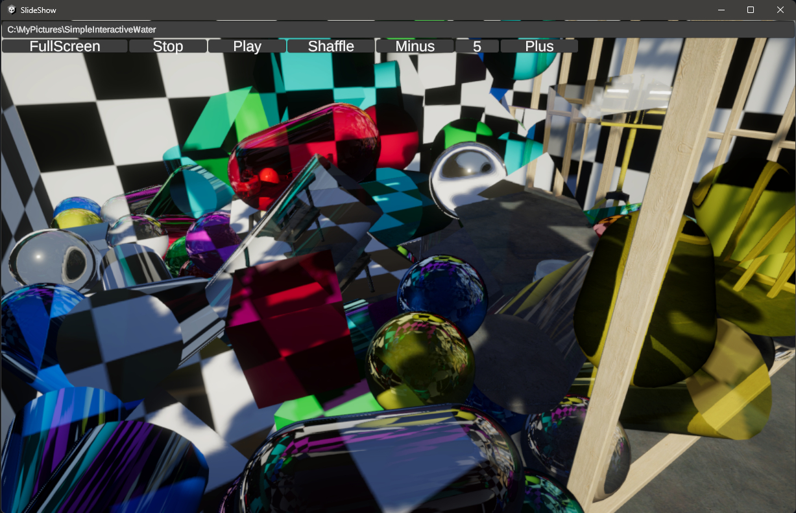

# What is this?

I noticed that Windows 11 does not have a slideshow feature for images, so I quickly made one with Unity.  
It’s a simple project consisting of one script and a RawImage, so please feel free to use it as a reference.  

## How to use:
- Folder path input field: You can paste the folder path from Explorer and use it
- FullScreen button: Switches between full screen and window mode
- Stop button: Stops the automatic playback
- Play button: Starts the automatic playback
- Shaffle button: Shuffles the order of the images being played
- Minus button: Sets the image display time one second shorter
- Image display time: The image display time in seconds
- Plus button: Sets the image display time one second longer

## List of shortcut keys
- Space: Toggles between stopping and starting automatic playback
- Arrow key left: Displays the image that was displayed before
- Arrow key right: Displays the next image to be displayed
- Arrow key up: Stops automatic playback
- Arrow key down: Starts automatic playback
- Esc: Switches to window mode if it was full screen
