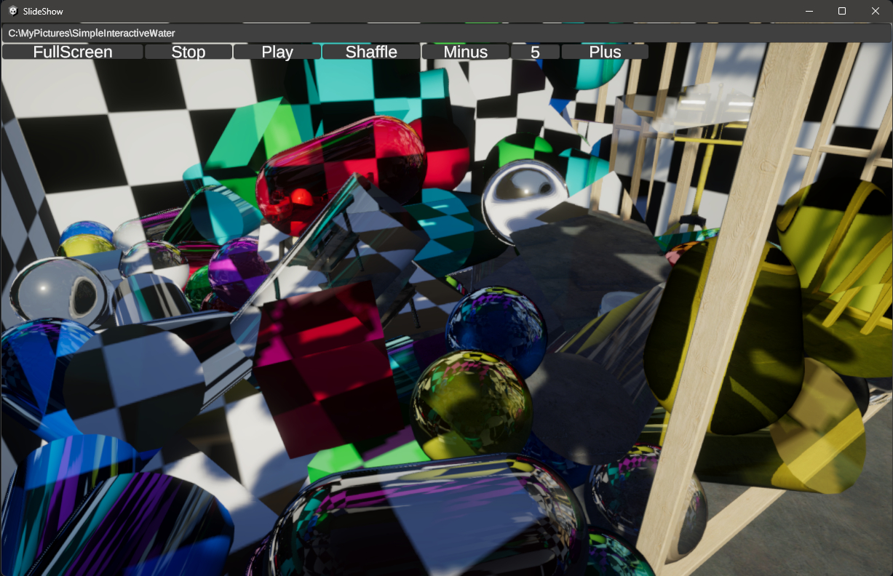

# What is this?

Windows11 に画像のスライドショーがないことに気付き、急遽 Unity でつくりました。  
スクリプト一つとRawImageで構成されたシンプルなプロジェクトなので、ぜひ参考にして使ってみてください  

## 使い方：  
- フォルダパス入力欄：エクスプローラーのフォルダパスを貼り付けてご利用できます  
- FullScreenボタン:フルスクリーンとウィンドウモードを切り替えます  
- Stopボタン：自動再生をストップします  
- Playボタン：自動再生を開始します  
- Shaffleボタン：再生中の画像順序をシャッフルします  
- Minusボタン：画像表示時間を一秒短く設定します  
- 画像表示時間：秒指定の画像表示時間です  
- Plusボタン：画像表示時間を一秒長く設定します  

## ショートカットキー一覧  
- Space：自動再生をストップ、自動再生の開始をトグルします  
- アローキー左：前に表示していた画像を表示します  
- アローキー右：次に表示する画像を表示します  
- アローキー上：自動再生をストップします  
- アローキー下：自動再生を開始します  
- Esc：フルスクリーンだった場合にウィンドウモードに切り替えます  
